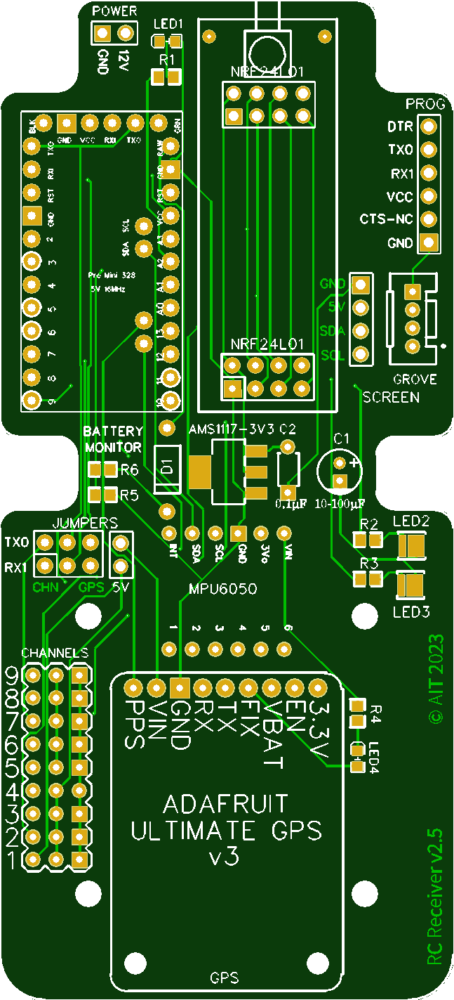
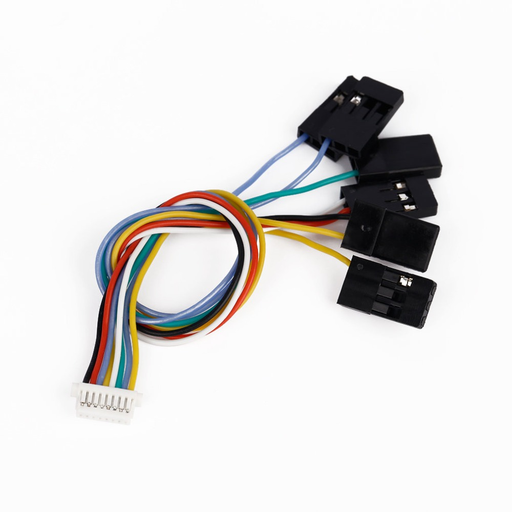

# RC-ESC_4in1_calibration
Calibration of ESC 4 in 1 LANNRC BLHELI_S 45A 60A

Board based on Arduino Pro Mini 5V / 16MHz

Connection between Arduino and ESC 4 in 1 by a 8 pin cable

# Procedure to calibrate the ESC
1. Connect the Arduino Pro Mini, the NRF24L01, ESC and flight controller
2. Switch on the receiver (Arduino)
The motors are then commanded to maximum speed
3. Switch on the transmitter (see )
4. Switch on the ESC
Wait for the end of the little music of the motor
5. Put the left toggle of transmitter to up position
Wait for the end of the little music of the motor
6. Put the left toggle of tramsitter to down position

# Finding the minimum and maximum throttle position
## Mini
1. Push the left outboard button of transitter to increase the motor command by 2
Until the motor rotates without stopping
2. Push the right outboard button to find the maximum
## Maxi
1. Push the left outboard button of transitter to decrease the motor command by 2
Until the motor sound changes
2. Push the right outboard button to find the minimum and maximum throttle for the next motor

# Test
Push the left outboard button of transmitter to decrease the four motor command by 50
Push the right outboard button of transmitter to increase the four motor command by 50
Push the left inboard button of transmitter to reset  the four motor command to 1000

# How to connect the Arduinon Pro Mini

| Pin | Function  | Connection |
|:---:|:---:      |:---:|
| 2   | CSN       | NRF24L01 |
| 3   | CE        | NRF24L01 |
| 4   | channel 1 | left front motor, M4 |
| 5   | channel 2 | right front motor, M2 |
| 6   | channel 3 | left rear motor, M3 |
| 7   | channel 4 | right rear motor, M1 |
| 8   | channel 5 | |
| 9   | channel 6 | |
| 10  | channel 9 | |
| 11  | MOSI      | NRF24L01 |
| 12  | MISO      | NRF24L01 |
| 13  | SCK       | NRF24L01 |
| A0  | LED 3     | |
| A1  | LED 2     | |
| A2  | LED 1     | |
| TX0 | channel 7 | |
| RX1 | channel 8 | |

